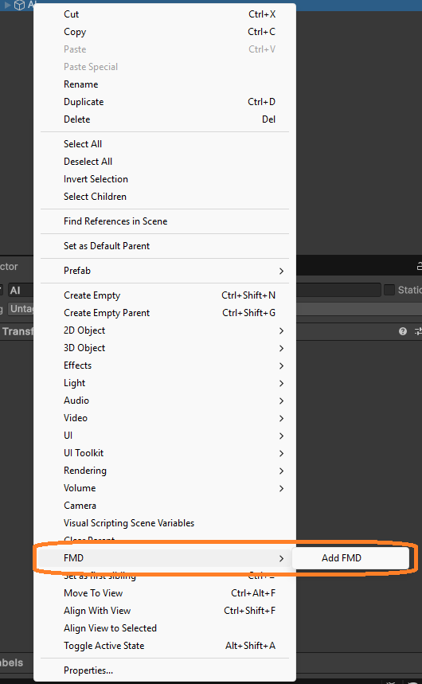
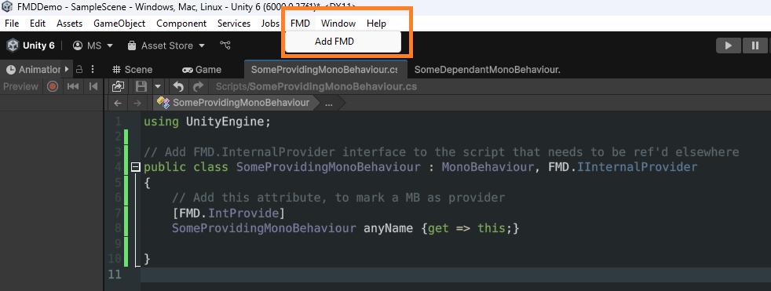
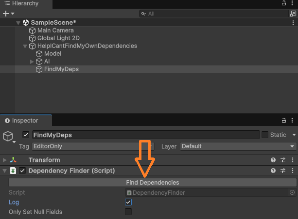
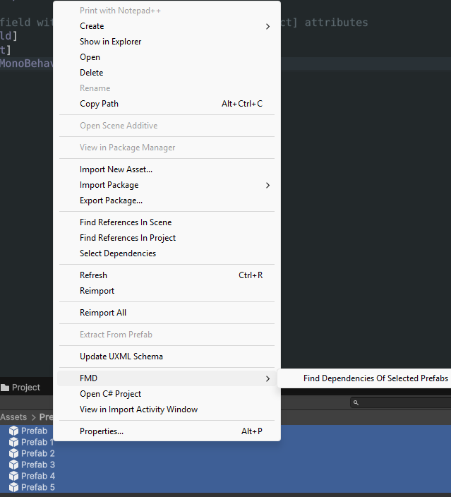

# FindMyDeps

Find my dependencies is a mini-DI tool for automatically checking and assigning MonoBehaviours on a single GameObject's hierarchy tree in editor time. One of the problems with using the GameObject hierarchy tree is that script dependencies can break very easily, for example:

* Public (or Serialized) fields are reset when a script is removed and created again on an object
* Using GetComponent\<T\> within the objects hierarchy will break if the object is restructured
* Similarly GetComponentInChildren\<T\> will break on certain object hierarchy changes

This tool introduces a simple internal DI for an object to check and automatically assign its MonoBehaviour script dependencies.

## Features

- Simple, opt-in DI for objects own MonoBehaviour dependencies (within its hierarchy tree)
- One button to automatically assign all of the injectable MonoBehaviour fields, if a matching script exists in the GameObject
- Run on prefabs, or run on on object in scene view
- Run on multiple prefabs with a right-click context menu in project window
- Editor-only so no runtime performance impact
- No background checking, only run on user commands
- No other dependencies or packages

## Example

In the providing script add this:

```
// Add FMD.InternalProvider interface to the script that needs to be ref'd elsewhere
public class SomeProvidingMonoBehaviour : MonoBehaviour, FMD.IInternalProvider
{
	// Add this attribute, to mark a MB as provider
	[FMD.IntProvide]
	SomeProvidingMonoBehaviour anyName {get => this;}
}
```

In any script that requires SomeProvidingMonoBehaviour add this:

```
public class SomeDependantMonoBehaviour : MonoBehaviour
{
	// Mark a MB field with [SerializeField] and [FMD.IntInject] attributes
	[SerializeField]
	[FMD.IntInject]
	SomeProvidingMonoBehaviour aDependency;
}
```

Use either the right-click context menu in scene view or the main menu to add FMD to an object selected in scene view:



OR



This creates a new FMD object with DependencyFinder attached to it:


Click this button to run FMD on the entire object:



You can run this on multiple prefabs from the project window too via right click context menu.



## Using FMD to inject Non-Monobehaviours

Let's say you'd like to inject some non-monobehaviours into your prefab. FMD supports this via property setting, and initialization via FMD.InitMethod attribute. Here is an example:

```
public class Model : MonoBehaviour, FMD.IInternalProvider
{
	[FMD.IntProvide]
	Model anyName {get => this;}

	[SerializeField]
	SpriteRenderer sprite_;
	public Animator ModelAnim;

	[FMD.InitMethod]
	void IAmAnInitMethod()
	{
		sprite_ = GetComponent<SpriteRenderer>();
		ModelAnim = GetComponent<Animator>();
	}
}
```

```
public class SomeDependantMonoBehaviour : MonoBehaviour
{
	// Mark a MB field with [SerializeField] and [FMD.IntInject] attributes
	[SerializeField]
	[FMD.IntInject]
	SomeProvidingMonoBehaviour aDependency;

	[SerializeField]
	SpriteRenderer depSprite_;
	[SerializeField]
	Animator anim_;

	[FMD.IntInject]
	Model propertySetterViaFMD
	{
		set
		{
			// Set via GetComponent if you know that the component is attached in the same GO
			depSprite_ = value.GetComponent<SpriteRenderer>();
			// Set via a public property
			anim_ = value.ModelAnim;
		}
	}
}

```

## Limitations

- No runtime usage - editor only
- Only checks MonoBehaviour dependencies of a GameObject and its children (and all subchildren, recursively). No scene-wide DI.
- Only one provider per gameObject supported - if multiple are found, the last one will be used
- It does not create provider scripts - if one is not found you have to create it yourself
- In case of 'Missing reference' in a ref (a previously set reference has been destroyed) be sure to uncheck 'Only Set Null Fields'. Apparently Missing References are not null.

If you have any feedback or comments, you can reach me via marcinwszymanek@gmail.com
